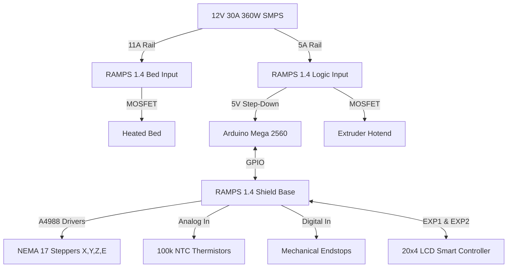

# P04: Custom 3D Printer


## Executive Overview
Additive manufacturing represents a transformative methodology in mechanical engineering and rapid prototyping. This project details the design, assembly, calibration, and commissioning of a custom-built Cartesian 3D Printer based on the open-source RepRap architecture. The machine integrates a robust RAMPS 1.4 control shield with an Arduino Mega 2560, running Marlin firmware to translate digital G-code instructions into precise physical kinematics.

> [!WARNING]
> **High-Current Thermal Hazards**
> 3D printers pull continuous high current for hours at a time. The 11A circuit driving the heated bed on the RAMPS 1.4 shield is prone to overheating, which can cause connector melting or fire if terminals loosen. Ensure heavy-gauge wire (14 AWG) with crimped ferrules is used, and always enable `THERMAL_RUNAWAY_PROTECTION` in the Marlin firmware to automatically shut down heaters if a thermistor dislodges.

## Feature Highlights
- **Cartesian 3-Axis Kinematics**: Precision X, Y, and Z spatial positioning utilizing NEMA 17 stepper motors and linear bearings.
- **Modular Control Electronics**: The RAMPS 1.4 shield atop an Arduino Mega allows rapid replacement of individual A4988 stepper drivers and direct MOSFET control.
- **Dual Thermal Zones**: Independent PID-controlled heated extruder (hotend) and heated build platform (preventing part warping).
- **Standalone Operation**: Full RepRap Discount Smart Controller LCD interface with SD-card rendering capabilities.

## System Architecture



## Theoretical & Mathematical Models

### Kinematic Resolution (Steps per mm)
To ensure dimensional accuracy, the firmware must accurately map stepper motor pulses to physical linear movement.
For a belt-driven axis (X and Y), the steps per millimeter ($S$) is calculated as:
$$ S = \frac{SPR \times MS}{P \times T} $$
Where:
- $SPR$ = Stepper steps per revolution (Typically 200 for a 1.8° motor).
- $MS$ = Microstepping factor set via jumpers (e.g., 16 for A4988).
- $P$ = Belt pitch in mm (e.g., 2mm for GT2 belts).
- $T$ = Pulley tooth count (e.g., 20 teeth).
$$ S = \frac{200 \times 16}{2 \times 20} = 80 \text{ steps/mm} $$

### Driver Current Tuning
To prevent missed steps without exceeding motor thermal limits, the stepper driver reference voltage ($V_{ref}$) is tuned:
$$ V_{ref} = 8 \times I_{max} \times R_s $$
Where $I_{max}$ is the target motor phase current and $R_s$ is the sense resistor value (typically $0.1\Omega$).

## Hardware Bill of Materials (BOM)
| Component | Specification | Quantity |
| :--- | :--- | :--- |
| Microcontroller | Arduino Mega 2560 R3 | 1 |
| Expansion Shield | RAMPS 1.4 | 1 |
| Stepper Drivers | A4988 or DRV8825 Modules | 4-5 |
| Motors | NEMA 17 Stepper Motors | 4-5 |
| Hotend Assembly | E3D V6 (or J-Head equivalent) | 1 |
| Heated Bed | MK2B / MK3 PCB Heater | 1 |
| Sensors | 100k NTC Thermistors | 2 |
| Interface | RepRap Discount Smart Controller (20x4 LCD) | 1 |
| Power Supply | 12V 30A (360W) Switched-Mode PSU | 1 |

## Complete Pinout & Power Allocation Matrix Table
| Component | Terminal / Type | RAMPS 1.4 Connection | Notes |
| :--- | :--- | :--- | :--- |
| **Power Inputs** | 12V 11A | Bed Power Block (Bottom) | Requires 14 AWG wire |
| | 12V 5A | Logic Power Block (Top) | Powers Mega & Extruder |
| **Heaters** | D8 | MOSFET Output | Heated Bed |
| | D10 | MOSFET Output | Extruder Heater (Hotend0) |
| **Sensors** | T0 (A13) | Thermistor Input | Hotend Temp Sensor |
| | T1 (A14) | Thermistor Input | Bed Temp Sensor |
| **Endstops** | X_MIN, Y_MIN, Z_MIN | Endstop Headers | Wired Normally Closed (NC) |
| **Motors** | X, Y, Z, E0 | 4-Pin Headers | Z-axis utilizes dual parallel output |

## Repository Layout Tree
```text
.
├── docs/                  # Academic 3D printer report and specifications [VERIFIED]
│   └── images/            # Original photography of the physical build [ORIGINAL]
├── firmware/              # Baseline Marlin configuration file [RECONSTRUCTED]
├── hardware/              # Power distribution specifications and driver math [RECONSTRUCTED]
└── _archive/              # Draft iterations and redundant documents
```

## Step-by-Step Firmware Setup & Prerequisites
1. Download the [Arduino IDE](https://www.arduino.cc/en/software) and [Marlin Firmware 1.1.x / 2.0.x source](https://marlinfw.org/).
2. Copy `firmware/Configuration_RAMPS14_baseline.h` and rename it to `Configuration.h`, replacing the default file in the Marlin source directory.
3. Open `Marlin.ino` in the Arduino IDE.
4. Select **Arduino Mega 2560** as the target board under the `Tools` menu.
5. Connect the printer via USB and compile/upload the firmware.
6. Verify motor direction and calibrate E-steps utilizing a caliper and 100mm extrusion test.

## Authentic Documentation & Historical Asset Links
- **Project Report**: [`docs/3D Printer Report 2.pdf`](docs/3D%20Printer%20Report%202.pdf) **[VERIFIED]**
- **Machine Captures**: [`docs/images/`](docs/images/) **[ORIGINAL]**

## Engineering Audit & Defensibility Limitations
- **Missing Original Firmware Assets**: The specific PID values and dimensional steps/mm tuned for this exact physical printer were not historically preserved. The provided `Configuration_RAMPS14_baseline.h` serves as a **[RECONSTRUCTED]** architectural baseline representative of the machine described in the academic report.
- **Structural Rigidity Tradeoffs**: Open-source threaded rod or acrylic frame designs (e.g., standard Prusa i3 clones) often suffer from Z-wobble and resonant vibrations at higher print speeds ($>60\text{ mm/s}$). Upgrading to an aluminum extrusion (2020 profile) chassis significantly mitigates these artifacts.

---

**Hassan Moqbel Morshed Ghaleb**
Mechatronics Engineer | Mechanical Design & CAD (SolidWorks & AutoCAD) | Preventive Maintenance & Electromechanical Systems | Industrial Automation, Control Systems, Robotics & Intelligent Machines | CAD/FEA, Embedded Systems, Python & C++
[GitHub](https://github.com/Hassan-Moqbel) · [Facebook](https://www.facebook.com/share/1BqxAgVjHi/) · [LinkedIn](https://www.linkedin.com/in/hassan-moqbel)

## License
This project is licensed under the [GPL-3.0 License](LICENSE).
